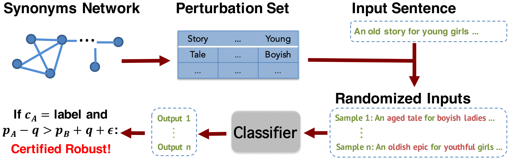

# SAFER: A Structure-free Approach For Certified Robustness to Adversarial Word Substitutions (ACL 2020)

We propose a certified robust method based on a new randomized smoothing technique, which constructs a stochastic ensemble by applying random word substitutions on the input sentences, and leverage the statistical properties of the ensemble to provably certify the robustness. Our method is simple and structure-free in that it only requires the black-box queries of the model outputs, and hence can be applied to any pre-trained models (such as BERT) and any types of models (world-level or subword-level).

</img>

## How to run
Download the word embedding file and save to root directory
https://drive.google.com/file/d/1x65ixChKFlWHCecfm6rkZTGT6MlreAIO/view?usp=sharing

Download the dataset
Amazon: https://www.kaggle.com/bittlingmayer/amazonreviews#train.ft.txt.bz2

See run.sh for data processing, training and evaluation.

## Citation

    @inproceedings{ye-etal-2020-safer,
      title = "{SAFER}: A Structure-free Approach for Certified Robustness to Adversarial Word Substitutions",
      author = "Ye, Mao  and
        Gong, Chengyue  and
        Liu, Qiang",
      booktitle = "Proceedings of the 58th Annual Meeting of the Association for Computational Linguistics",
      month = jul,
      year = "2020",
      address = "Online",
      publisher = "Association for Computational Linguistics",
      url = "https://www.aclweb.org/anthology/2020.acl-main.317",
      doi = "10.18653/v1/2020.acl-main.317",
      pages = "3465--3475",
    }

## Acknowledgements
A large portion of this repo is borrowed from the following repo:
https://github.com/huggingface/transformers
